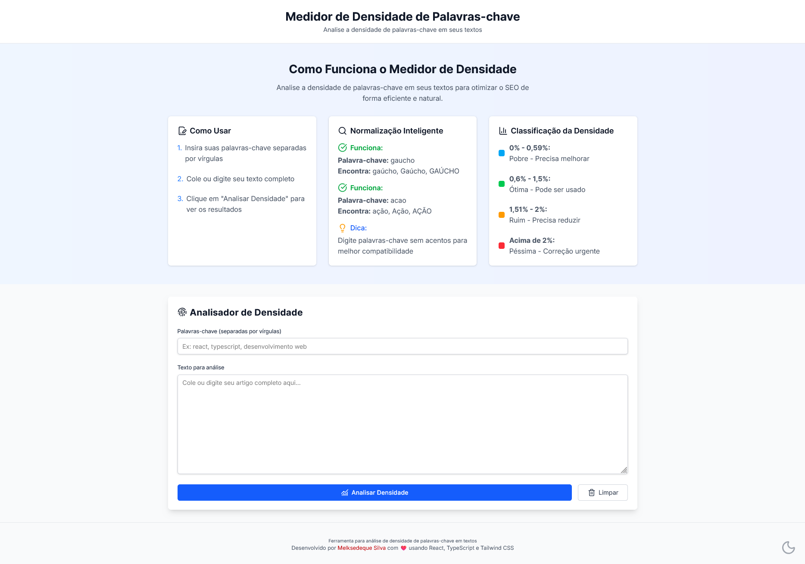
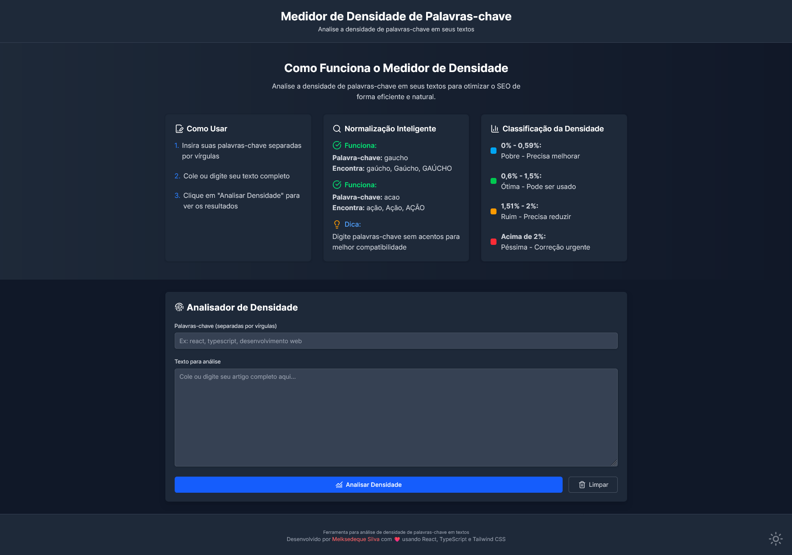

# Medidor de Densidade de Palavras-chave 📊




## Menu

- [Descrição](#descrição)
  - [Layout do Projeto](#layout-do-projeto)
  - [Principais recursos incluem](#principais-recursos-incluem)
- [Tecnologias Utilizadas](#tecnologias-utilizadas)
- [Estrutura de Pastas](#estrutura-de-pastas)
  - [Arquivos Principais](#arquivos-principais)
- [Como Instalar e Rodar o Projeto](#como-instalar-e-rodar-o-projeto)
  - [Pré-requisitos](#pré-requisitos)
  - [Instalação](#instalação)
  - [Configuração](#configuração)
  - [Casos de Uso Comuns](#casos-de-uso-comuns)
  - [Solução de Problemas](#solução-de-problemas)
- [Projeto ao Vivo](#projeto-ao-vivo)
- [Fluxo de Dados](#fluxo-de-dados)
- [Próximos Passos de Desenvolvimento](#próximos-passos-de-desenvolvimento)
- [Licença](#licença)
- [Autor](#autor)

## Descrição

O **Medidor de Densidade de Palavras-chave** é uma ferramenta web desenvolvida para análise de densidade de palavras-chave em textos. Ideal para profissionais de SEO, redatores e criadores de conteúdo que precisam otimizar seus textos para mecanismos de busca.

### Layout do Projeto

A aplicação possui um design moderno e responsivo com:
- **Tema claro/escuro** com alternância automática
- **Interface intuitiva** com seções bem definidas
- **Botão flutuante** para alternar temas no canto inferior direito
- **Tabela de resultados** com classificação por cores baseada na densidade

### Principais recursos incluem

- ✅ **Análise de densidade de palavras-chave** em tempo real
- 🔍 **Normalização inteligente de texto** (remove acentos, cedilhas)
- 📊 **Classificação automática** da densidade (Pobre, Ótima, Excessiva)
- 🌙 **Modo escuro/claro** com persistência no localStorage
- 📱 **Design responsivo** para todos os dispositivos
- 🎯 **Busca por palavras completas** evitando falsos positivos
- 🇧🇷 **Compatibilidade com português brasileiro** (acentos e cedilhas)
- 💾 **Interface limpa** com botões de limpeza rápida

## Tecnologias Utilizadas

### Frontend

- **React 19** - Biblioteca para construção da interface
- **TypeScript 5.8.3** - Superset do JavaScript com tipagem estática
- **Vite 6.0** - Build tool e dev server ultrarrápido
- **Tailwind CSS 4.1** - Framework CSS utilitário para estilização
- **PostCSS** - Processador CSS para otimização

### Utilitários

- **Lucide React** - Biblioteca de ícones SVG para React
- **@tailwindcss/postcss** - Plugin PostCSS para Tailwind CSS
- **Autoprefixer** - Plugin PostCSS para compatibilidade de browsers

### Ferramentas de Desenvolvimento

- **ESLint** - Linter para JavaScript/TypeScript
- **TypeScript ESLint** - Regras específicas para TypeScript
- **Vite TypeScript** - Configuração TypeScript para Vite

## Estrutura de Pastas

```
src/
├── components/          # Componentes React
│   ├── Header.tsx       # Cabeçalho da aplicação
│   ├── Footer.tsx       # Rodapé com botão de tema
│   ├── ExplanationSection.tsx  # Seção explicativa
│   └── KeywordAnalyzer.tsx     # Componente principal de análise
├── hooks/               # Hooks customizados
│   └── useTheme.ts      # Hook para gerenciamento de tema
├── utils/               # Funções utilitárias
│   ├── keywordAnalyzer.ts      # Lógica de análise de densidade
│   └── textNormalizer.ts       # Normalização de texto
├── types/               # Definições de tipos TypeScript
│   └── index.ts         # Tipos principais da aplicação
└── assets/              # Recursos estáticos
```

### Arquivos Principais

- **`App.tsx`** - Componente raiz da aplicação
- **`main.tsx`** - Ponto de entrada da aplicação
- **`index.css`** - Estilos globais e configuração do Tailwind
- **`useTheme.ts`** - Gerenciamento de estado do tema
- **`keywordAnalyzer.ts`** - Algoritmo de análise de densidade
- **`textNormalizer.ts`** - Normalização de texto para português

## Como Instalar e Rodar o Projeto

### Pré-requisitos

- **Node.js** (versão 18 ou superior)
- **npm** ou **yarn** para gerenciamento de pacotes

### Instalação

1. Clone o repositório:
```bash
git clone https://github.com/Melksedeque/medidor-densidade-palavras-chave.git
cd medidor-densidade-palavras-chave
```

2. Instale as dependências:
```bash
npm install
# ou
yarn install
```

### Configuração

3. Inicie o servidor de desenvolvimento:
```bash
npm run dev
# ou
yarn dev
```

4. Acesse a aplicação em `http://localhost:5173`

### Casos de Uso Comuns

#### Build para Produção
```bash
npm run build
```

#### Preview da Build
```bash
npm run preview
```

#### Linting
```bash
npm run lint
```

### Solução de Problemas

- **Erro de PostCSS**: Certifique-se de que `@tailwindcss/postcss` está instalado
- **Tema não funciona**: Verifique se o `useTheme` está sendo chamado no componente raiz
- **Estilos não carregam**: Confirme que o `index.css` está sendo importado corretamente

## Projeto ao Vivo

🚀 **[Acesse a aplicação](https://medidor-densidade-palavras-chave.vercel.app)**

*Hospedado no Vercel com deploy automático*

## Fluxo de Dados

### Estados Locais

- **`keywords`** - Array de palavras-chave inseridas pelo usuário
- **`text`** - Texto a ser analisado
- **`results`** - Resultados da análise de densidade
- **`isAnalyzing`** - Estado de carregamento da análise
- **`theme`** - Tema atual (light/dark) persistido no localStorage

### Fluxo de Funcionamento

1. **Entrada de dados**: Usuário insere palavras-chave e texto
2. **Normalização**: Texto e palavras são normalizados (remoção de acentos)
3. **Análise**: Algoritmo calcula densidade e ocorrências
4. **Classificação**: Resultados são classificados por faixas de densidade
5. **Exibição**: Tabela colorida mostra os resultados

### Hooks Customizados

- **`useTheme`** - Gerencia tema claro/escuro com persistência
- **`useState`** - Estados locais dos componentes
- **`useEffect`** - Efeitos colaterais e sincronização

## Próximos Passos de Desenvolvimento

### 🚀 Funcionalidades Futuras

- [ ] **Exportação de relatórios** em PDF/CSV
- [ ] **Análise de múltiplos textos** em lote
- [ ] **Sugestões de otimização** baseadas em SEO
- [ ] **Histórico de análises** com localStorage
- [ ] **Comparação de textos** lado a lado
- [ ] **API para integração** com outras ferramentas
- [ ] **Análise de concorrentes** por URL

### 🔧 Melhorias Técnicas

- [ ] **Testes unitários** com Jest e React Testing Library
- [ ] **Testes E2E** com Cypress
- [ ] **PWA** para uso offline
- [ ] **Internacionalização** (i18n) para múltiplos idiomas
- [ ] **Performance** com React.memo e useMemo
- [ ] **Acessibilidade** (WCAG 2.1)

### 💡 Sugestões e melhorias são sempre bem-vindas!

Abra uma [issue](https://github.com/Melksedeque/medidor-densidade-palavras-chave/issues) ou envie um [pull request](https://github.com/Melksedeque/medidor-densidade-palavras-chave/pulls).

## Licença

Este projeto está licenciado sob a Licença MIT. Veja o arquivo [LICENSE](LICENSE) para mais detalhes.

**Uso não comercial** - Sinta-se livre para usar, modificar e distribuir este projeto para fins educacionais e pessoais.

## Autor

- GitHub - [Melksedeque](https://github.com/Melksedeque)
- Frontend Mentor - [Melksedeque](https://www.frontendmentor.io/profile/Melksedeque)
- Twitter/X - [@SouzaMelk](https://x.com/SouzaMelk)
- LinkedIn - [Melksedeque Silva](https://www.linkedin.com/in/melksedeque-silva/)

---

⭐ **Se este projeto foi útil para você, considere dar uma estrela no repositório!**
